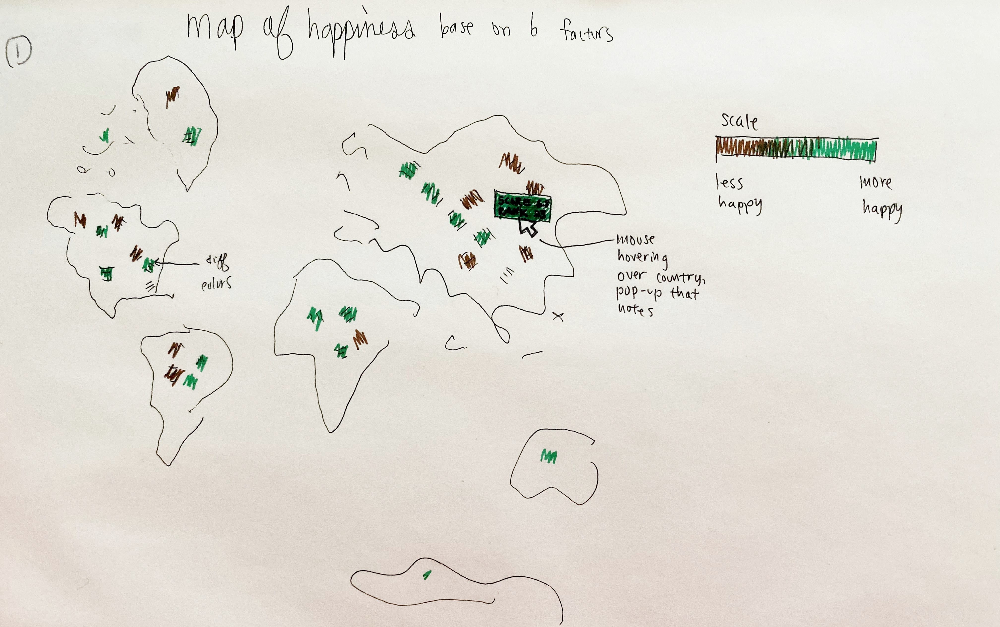
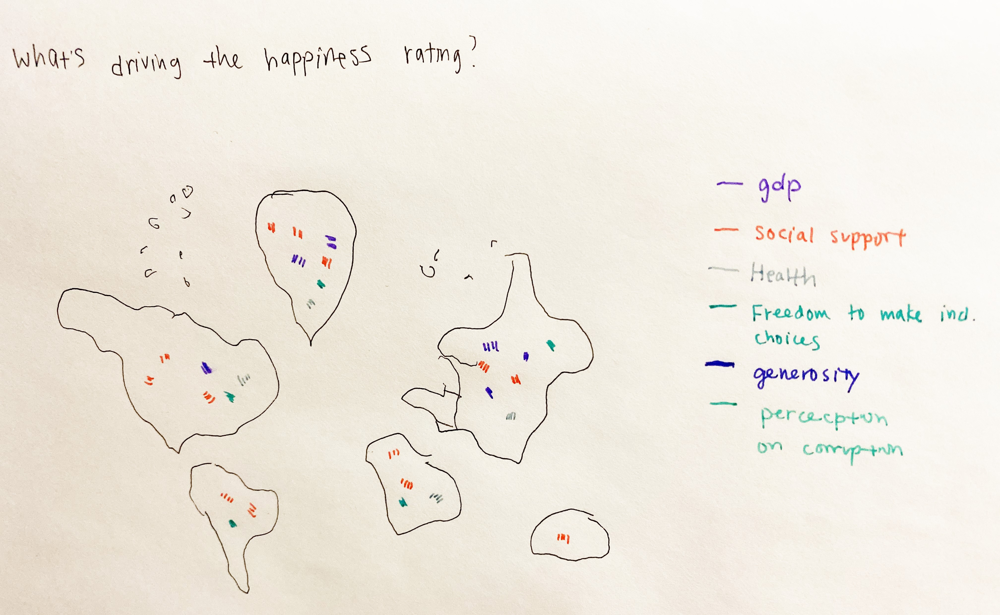
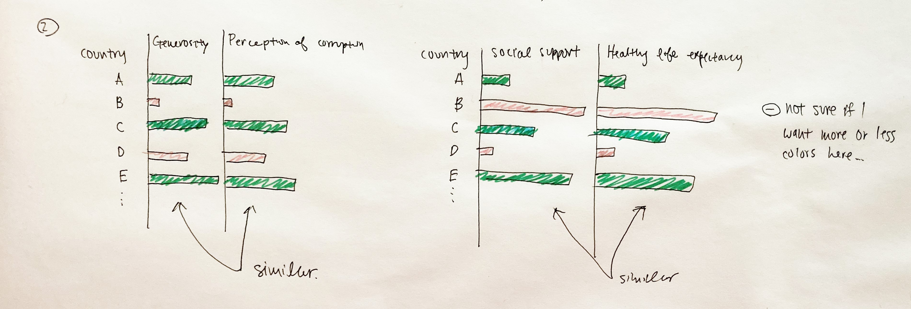

# Eileen Wang's final project - A tangible way to find happiness
This is part 1 of my final project for Storytelling with Data class, at Carnegie Mellon University. Below you will find my project proposal. 

# An Outline - High level summary of my project
How happy people are is a difficult question to answer- afterall, happiness is not a concept you can generalize across nations nor individuals. I'm interested in 1) exploring and identifying key factors that drive happiness and how they relate to one another, and 2) using the data to suggest tangible and personal actions that will motivate viewers to pursue happiness now. 

# An Outline- Project structure / Story arc
1. Beginning, a birds-eye view of each nation's happiness: 

I'm thinking of using a map view that will show the happiness score and ranking as the mouse hovers over each nation. In this map, I will not give any clues for why each nation landed on their specific score. At this point, viewers may take a moment to process and make hypotheses about the factors that play into the happiness ranking.  

2. Middle, giving viewers a little more context: 

Here I will reveal the 6 factors that play into the happiness score. Each will follow with a brief description of what it is. At this point, viewers may think that each factor as independent and abstract.  

3. Middle, looking at key drivers of happiness for each nation: 

Here I want viewers to see that in the equation of happiness, each of the factors do not play an equal role. By showing a map with the factor that is driving the happiness score in each nation, viewer can begin to understand that the idea of happiness is driven by different motivations, locally and internationally. 

4. Climax, realizing that reaching happiness does not mean checking off items on a list: 

Continuing the conversation that happiness is driven by different factors across nations, I also want to share that there are important relationships between different factors as well. Initially, viewers may assume each factor has equal weight in determining happiness. However, I want to share charts that show the relationship of two or more factors in affecting each country. For example, social support is highly correlated to healthy life expectancy. This might help viewers realize that the best way to obtain happiness is not by simply checking off each factor from their list. Rather, it's about examinining the relationship of factors, and understanding how they can create opportunities to nurture the factors together. 

5. Ending, a call to action:

In the end, I want viewers to feel that obtaining happiness for themselves can be done through a tactile plan. For example to continue the conversation that a healthy life expectancy is more likely when paired with social support, I might link the audience to pages like meetup.com to help them start building more extensive social circles. 

# Initial sketches
Map of happiness to introduce the initial impression gathered from the dataset: 

Map of key factor that is driving happiness rating from the dataset: 

Comparison of factors to help viewers start thinking about how factors relate to each other, and are not just independent "checklist items":

# The data
This dataset is from the [World Happiness Report 2019](https://www.kaggle.com/unsdsn/world-happiness#2019.csv), which is supported by the United Nations, and also studied by global leaders to understand how they can improve happiness for citizens. The 6 factors that were used to estimate a overarching happiness score for each nation are: GDP per capita, social support, healthy life expectancy, freedom to make life choices, generosity, and perceptions of corruption. 

I plan to plot the data onto a map to begin with, which will ignite viewer curiousity to study the rankings of each country. However, I am also looking to dig deeper into the relationship of pairs of factors, to understand if there is any correlation. I might use bar charts to illustrate where there is strong relationships and weak relationships. 

# Medium & Method
I plan on building my story using Shorthand. I think the linear format (scrolling down) will work well for helping viewers focus on one piece of information at a time, and not jump to conclusion. In terms of the data visualizations, I want to use Tableau to build the maps in stages 1, 3, and 4 in my story arc. 

In order to complete my final projects, there are a couple items I need to work out. For stage 3, I need to clean the data and add a extra column to draw out the key factor driver of happiness for each nation in Excel. Next, in stage 4, even though I have my intent thought out for the data (show relationships between factors), I am not 100% confident that bar charts is the optimal data visualization. To find out, I will sketch a couple different visualziation solutions, and show my friends to gather some feedback. Stage 5's action recommendations are dependent on the key relationships I will identify in stage 4. Recommending that viewers sign up for Meetup is just one action I will have, and there should be 1 or 2 more actions that come out of the analysis from stage 4. 
